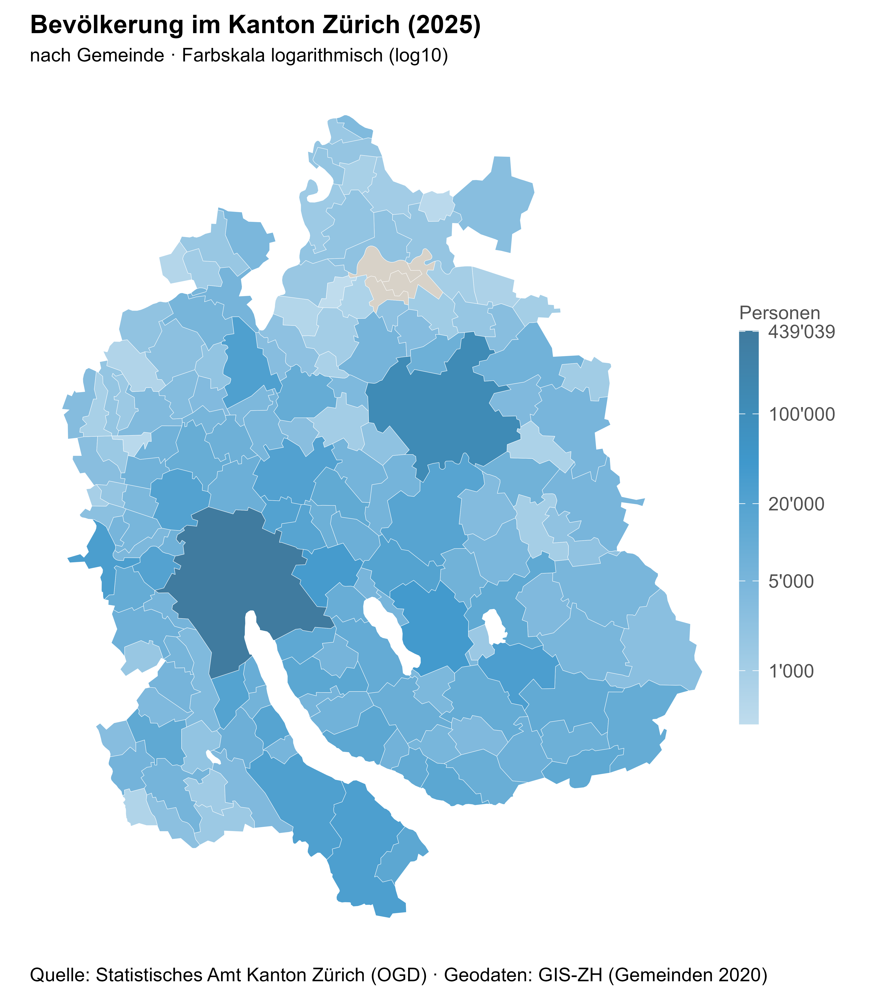

# zh-ogd-population-map

A small exploration of the [`statR`](https://github.com/statistikZH/statR) package
and the open government data (OGD) of the Statistical Office of the Canton of Zurich.

The analysis maps the 2025 population of the canton's municipalities as a
choropleth, styled with the canton's own `statR` design.



## Data

- **Population:** Bevölkerung nach Gemeinde, Statistical Office of the Canton of Zurich (OGD)
- **Geometry:** Generalised municipal boundaries (A4, 2020), GIS-ZH

## Tools

`R` · `statR` · `sf` · `tidyverse` · `Quarto`

## Run

Open `StatR_testing.qmd` in RStudio and render it, or from the terminal:

```bash
quarto render StatR_testing.qmd
```

The data is downloaded automatically by the script.
